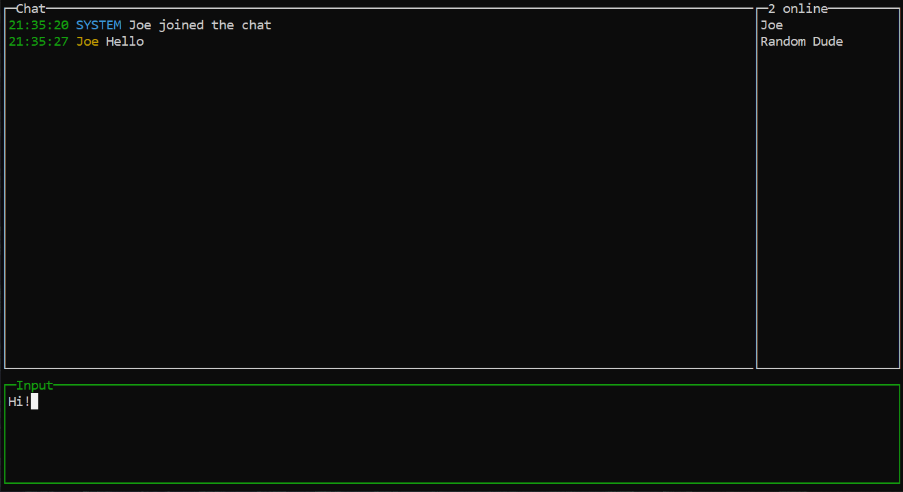

# go_chat_client

Very simple chat, client side.



Server is [here](https://github.com/SCP002/go_chat_server).

## Keybindings

* `Tab` - focus next window.
* `Enter` - send message if input window is currently focused.
* `Arrow Up` - scroll upwards if chat or online users window is currently focused.
* `Arrow Down` - scroll downwards if chat or online users window is currently focused.
* `F2` - open/close online users window.
* `F3` - insert newline if input window is currently focused. \*[1]
* `Ctrl + C` - exit.

\*[1] - Due to limitations of underlying UI library.

## Comand line flags

| Command argument     | Description                                                                         |
| -------------------- | ----------------------------------------------------------------------------------- |
| -v, --version        | Print the program version                                                           |
| -h, --help           | Print help message                                                                  |
| -l, --logLevel       | Logging level. Can be from `0` (least verbose) to `6` (most verbose) [default: `4`] |

## Config fields

* `server_address` - Server address in format of `host:port`.
* `tls_mode` - Connect to server using TLS protocol?
* `nickname` - User name to login with.

## Tips

* On first run, it will ask for server address, tls mode and nickname, and store it in config.
  Config file will be created automatically in the folder of executable.

## Downloads

See [releases page](https://github.com/SCP002/go_chat_client/releases).

## Build from source code [Go / Golang]

1. Install [Golang](https://golang.org/) 1.21.4 or newer.

2. Download the source code:  

    ```sh
    git clone https://github.com/SCP002/go_chat_client.git
    ```

3. Install dependencies:

    ```sh
    go mod tidy
    ```

    Or

    ```sh
    go get ./...
    ```

4. Update dependencies (optional):

    ```sh
    go get -u ./...
    ```

5. To build a binary for current OS / architecture into `./build/` folder:

    ```sh
    go build -o ./build/ main.go
    ```

    Or use convenient cross-compile tool to build binaries for every OS / architecture pair:

    ```sh
    go get github.com/mitchellh/gox
    go install github.com/mitchellh/gox
    gox -output "./build/{{.Dir}}_{{.OS}}_{{.Arch}}" ./
    ```
